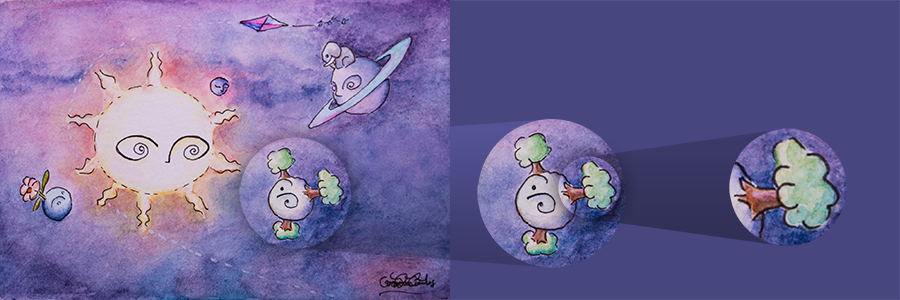
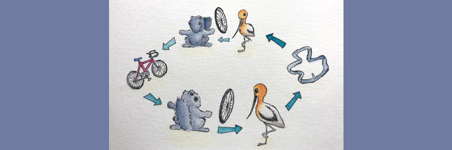

[]()
[]()

#  Telescope


Telescope is another state management library for JS ecosystem, this time based on lenses. It's an alternative to Redux for the brave as it's still a baby learning to give its first steps.

## The Basics

A _telescope_ is a special object that handle changes on a complex state by providing handlers to smaller pieces of the big structure, each of these handlers is a new _telescope_ and they are created by _magnifying_ up a special part of the whole thing. As with regular magnification, you need _lenses_ to do this, so, we provide the _lens_ and the _telescope_ focus on what is needed.

```typescript
class Telescope<U> {
  readonly stream: Observable<U>;

  static of<U>(initialState: U): Telescope<U>;

  public evolve(evolution: Evolution<U>): void;

  public update(newState: U): void;

  public magnify<P>(lens: Lens<U, P>): Telescope<P>;
}
```

So it can be said that a _telescope_ is like a telescope (or a microscope) that focuses on fragments of a bigger universe and allows users to manipulate the whole universe through updates on the fragments.



A _lens_ is a pair of functions, one to get values from an bigger object and another one from creating big objects with a piece and a previos big object:

```typescript
{
  getter : (u: U) => P;
  setter : (p: P, u: U) => U;
}
```

The final implementation is a bit more loaded, but this is the essence.

Lenses can be composed, and this is one of their great features, once you can compose blocks of any type, you have a magical way to create new ones.

To have a more concrete idea of what is going on we can look into an example: 

Suppose you have a bicycle and while doing some fun riding you get a flat tire. You know how to temporarily fix a tube, but you have no clue on how to get the tube out from the bike. Fortunately you have two friends, the black squirrel that knows how to get a  wheel out from a bike and an avocet that knows how to get out a tube from a wheel, they of course know how to put things together.

So, how do you fix the tire? You give the bike to the black squirrel who returns you the wheel which you pass to the avocet who gives you the tube which you fix and give back to the avocet who gives you the wheel that you pass now to the black squirrel that finally returns you the whole working bike.



Let’s make that more clear with code:

```typescript
import {Telescope} from 'telescope';

// Your super power to fix tubes: (Bike) => Bike
import {fixTube} from './awesome_toolkit';

// A couple of lenses friends of you:
// blackSquirrel: Lens<Bike, Wheel>
// avocet: Lens<Wheel, Tube>
import {blackSquirrel as tireLens, avocet as tubeLens} from './friends';

import {Bike, brandNewBike} from './Bike';

// You start your ride with a shining bicycle.
const ride = Telescope().of(brandNewBike);

// You subscribe to the ride in case something happens.
ride.stream.subscribe(
  (bike) => bike.hasFlatTire ? fixBike(bike, ride) : keepGettingFun()
)

// ... bunch of other things may happen.

const fixBike = (bike: Bike, ride: Telescope<Bike>): void =>
  ride
    // Ask the squirrel for the wheel.
    .magnify(tireLens)
    // Ask the avocet for the tube.
    .magnify(tubeLens)
    // Fix the tube.
    // Telescope will pass the pieces back to your friends so you get back your bike in the stream.
    .evolve(fixTube);
```

The good part about this all is that the main pieces of functionality are clearly separated and can be easily tested:
* Evolutions, which are or should be _pure_ functions, where you update the small fragments of your state.
* Lenses, which are or should be pairs of _pure_ functions (`getter` and `setter`), where you extract fragments and put back together the bigger values.

As an extra bonus, lenses can be composed so you can zoom in and out using them.

## Lens Composition

Telescope lenses are special machines that can transform an _evolution_ on a type of values `A` into another _evolution_ on type of values `B`. That is, they are kind of a function from `Evolution<A>` to `Evolution<B>`. Let’s write them as:

```
Lens<A,B> kinda Evolution<A> ~> Evolution<B>
```

And as functions they can be composed as long as the types matches):

```
Evolution<A> ~> Evolution<B> ~> Evolution<C>
// Becomes:
Evolution<A> ~> Evolution<C>
```

As in regular typescript functions, there is no special operator for composition, but Telescope lenses are equipped with the method `compose` which does what we expect. In our previous example we can now do a small refactor:

```typescript
// …
const fixBike = (bike: Bike, ride: Telescope<Bike>): void =>
  ride
    // Ask the squirrel and the avocet for the tube.
    .magnify(tireLens.compose(tubeLens))
    // Fix the tube.
    // Telescope will pass the pieces back to your friends so you get back your bike in the stream.
    .evolve(fixTube);
```

Having composition is actually a big thing which allows for: reducing testing scenarios as only small lenses need to be tested, composite lenses are as good as its elements; and decoupling responsibilities as lenses can live in the code closer to the data structures they handle.

## Using Telescope

We’ll see how to use Telescope in a simplified TODO application. Let’s start with a general domain definition agnostic of any framework:

```typescript
// A type for the global state.
class TodosState {
  readonly description: string;
  readonly todos: Todo[];

  static empty() {
    return new TodosState('', []);
  }

  constructor(description: string, todos: Todo[]) {…}

  copy(description: string, todos: Todo[]): TodosState {…}
  addTodo(description: string): TodosState {…}
  removeTodoAt(index: number): TodosState {…}
  setTodoAt(index: number, todo: Todo): TodosState {…}
}

class Todo {
  readonly description: string;
  readonly done: boolean;

  constructor(description: string = '', done: boolean = false) {…}

  copy(description: string, done: boolean): Todo {…}
}
```

With actions or side effects:

```typescript
// Given a Telescope on a Todo, toggle it.
const toggle = (telescope: Telescope<Todo>):void =>
  telescope.evolve(todo =>
	  todo.copy(todo.description, !todo.done));

const addTodo = (telescope: Telescope<TodosState>): void =>
  telescope.evolve((state) =>
    state.addTodo(state.description).copy('', undefined));

const removeTodoAt = (telescope: Telescope<TodosState>,index: number):void =>
  telescope.evolve((state) =>
    state.removeTodoAt(index));

const setDescription = (telescope: Telescope<TodosState>, description: string): void =>
  telescope.evolve((state) =>
    state.copy(description, undefined));
```

And one Lens:

```typescript
const todoAtLens = (index: number) =>
  new Lens<TodosState, Todo>(
    (state) => state.todos[index],
    (todo, state) => state.setTodoAt(index, todo)
  );
```


### React

This example shows how to integrate Telescope in a React application using the _Redux style_ which is to have a global state. The state is represented and maintained by a single stream inside a Telescope. We’ll use lenses and magnification only to keep a handle for our side effects.

As a bootstrap for the application we need something like:

```typescript
const telescope = Telescope.of<TodosState>(TodosState.empty());

telescope.stream.subscribe(
  (state) => {
    ReactDOM.render(
      <App telescope={telescope} state={state}/>,
      document.getElementById("app")
    );
  }
);
```

From then on, we don’t even need to subscribe to the stream, react will handle it for us.

```typescript
interface IProps {
  telescope: Telescope<TodosState>,
  state: TodosState
}

export const App = (props: IProps) =>
  <div>
    <TodoList telescope={props.telescope} state={props.state}/>
  </div>;
```

In React it will be easier to do state projections directly against the `props` of the components, but you can for sure use the getters.

```typescript
interface IProps {
  telescope: Telescope<TodosState>,
  state: TodosState
}

export const TodoList = (props: IProps) =>
  <div>
    <div>
      <label>
        What do you need to do?
        <input id="description"
           type="text"
           value={props.state.description}
           onChange={event => {
               setDescription(props.telescope, event.target.value);
           }}/>
      </label>
        <button onClick={() => addTodo(props.telescope)}>Add</button>
    </div>
    <TodosRawList todos={props.state.todos} telescope={props.telescope}/>
  </div>;

const TodosRawList = (props: { todos: Todo[], telescope: Telescope<TodosState> }) =>
  props.todos.length === 0 ?
  <p>Nothing to do! Add items above.</p> :
  <div>
    <ul>
      {
        props.todos.map((todo, index) =>
          <TodoItem
            key={index}
            todo={todo}
            telescope={props.telescope.magnify(todoAtLens(index))}
            onDelete={() => removeTodoAt(props.telescope, index)}/>)
      }
    </ul>
  </div>;

```

And finally:

```typescript
interface IProps {
  telescope: Telescope<Todo>
  todo: Todo
  key: number
  onDelete: () => void
}

export const TodoItem = (props: IProps) =>
  <li>
    <input type="checkbox" checked={props.todo.done} onChange={(_) => toggle(props.telescope)}/>
    <span>{props.todo.description}</span>
    <button onClick={(_) => props.onDelete()}>Delete</button>
  </li>;
```

Although this example is pretty simple and not even includes Lens composition, it shows the basics on how to integrate Telescope with React.

### Angular

Just as with React, but assuming Angular instead :)

As a bootstrap for the application we need something like:

```typescript
@Component({ ... changeDetection: ChangeDetectionStrategy.OnPush })
export class AppComponent {
  // Look Ma! no (explicit) subscriptions!
  readonly telescope = Telescope.of<TodosState>(TodosState.empty());
}
```

Here is the template for the main component, it can be optimized, but still you can see the simplicity:

```html
<todo-list [telescope]="telescope" [state]="telescope.stream | async">
</todo-list>
```

From then on, we don’t even need to subscribe to the stream, using the async pipe, Angular will handle it for us.

To render the Todos in a hierarchical mode we rely in the following component:

```typescript
export class TodoListComponent {
  newTodo: string = '';

  @Input()
  telescope: Telescope<TodosState>;

  @Input()
  state: TodosState;

  constructor() {
  }

  add(): void {
    setDescription(this.telescope, this.newTodo);
    addTodo(this.telescope);
    this.newTodo = '';
  }

  telescopeAt(index: number): Telescope<Todo> {
    return this.telescope.magnify(todoAtLens(index));
  }

  removeTodoAt(index: number): void {
    removeTodoAt(this.telescope, index);
  }
}
```

Note that we need to wrap the actions in instance methods since the controllers in angular serve as a namespace and we
cannot refer top level functions from the template.

```html
<div>
  <label for="description">What do you need to do?</label>
  <input type="text" id="description" [(ngModel)]="newTodo">
  <button (click)="add()">Add</button>
</div>

<ul>
  <todo *ngFor="let todo of state.todos; let i = index"
        [todo]="todo"
        (deleted)="removeTodoAt(i);"
        [telescope]="telescopeAt(i)">
  </todo>
</ul>
```
And finally:

```typescript
export class TodoComponent {
  @Output()
  deleted = new EventEmitter<void>();

  @Input()
  todo: Todo;

  @Input()
  telescope: Telescope<Todo>;

  remove(): void {
    this.deleted.next();
  }

  toggle(): void {
    toggle(this.telescope);
  }
}
```

And its template:

```html
<li>
  <input type="checkbox" [checked]="todo.done" (change)="toggle();">

  <span [class.done]="todo.done">{{todo.description}}</span>
  <button (click)="remove()">Delete</button>
</li>
```

As you can see, the Angular version is a bit more verbose but just like in the React counterpart, the controllers are
very simple in terms of logic, which results in components easier to test and  the same is true for the business logic.

## The Story

This story goes more or less as you would expect: How to handle changes on state in an application where many actors need to react to those changes and many actors are producing those changes?

The idea behind Telescope is that each change can be seen as a delta to the previous state, and the first challenge we face is that unless the state is some kind of _number-like_ value, it is not clear what a _delta_ is in this context. The key is that we don’t really need to know what this _delta_ is nor how to _add_ it to the previous state value, we can trust Telescope users to know what to do and encapsulate the _delta_ and the _adding_ process in a function, a function that will take a state value and return a new one:

```typescript
(s: State) => State
```

We call these type of functions `Evolutions` but they have other names too, in Mathematics they are commonly known as _endomorphisms_.

There is a caveat of course. As there are many values for this _deltas_ and maybe different _adding_ processes depending on the particular interaction happening in the application, there will be potentially many evolutions. In Telescope this is OK, evolutions are treated as regular values.

The Telescope idea comes from answering this question: What do we do with all these evolutions to get back our states?

The first observation we can do is that these evolutions are not just given, they are pumping up as the user, other systems or even internal processes interact with our application.

The way Telescope deals with this is a common pattern: Streams. But these are special streams, they are streams of evolutions, which is, streams of functions, we still need to figure out where to get values again.

Fortunately, streams belong to a big family of things that can be _folded_ and one special way of _folding_ is to generate a new _foldable_ with the partial results of the _folding_ steps. This _folding_ is commonly named `scan`.

Putting all together means to take the stream of evolutions and scan through it providing an initial state value as a seed (this value may come from a database or simply be a default state). And this is what a _telescope_ is: a convenient wrapper for a stream of evolutions so we can convert them into a stream of values.

The second part of this story is about how we can interact with these _telescopes_ and how we can create new ones from existing ones. That is, how can we create a world that _telescopes_ can inhabit?

Telescopes can be seen as consumers of values of a given type, let’s say `U` and produce values of the same type `U` through a stream. In order to convert a Telescope of `U`’s to a Telescope of `P`’s, we’ll need to provide two functions, one from `U` to `P` and another one from `P` to `U`.

This is all fine as long as this functions are inverses one to the other, but in many situations we want to convert the original `U` type into a _smaller_ `P`, that is, `P` has lees information than `U`. We do this through Lenses, a special attraction originally intended as a data accessor for nested structures. When we use a Lens to transform a Telescope, we say we do a _magnification_, that is, we use the given Lens to look only into the details that will be represented in the type `P`.

## Lenses

Lenses most common representation was described and implemented by Edward Kmett for Haskell ([github@ekmett/lens](https://github.com/ekmett/lens)) and since then have been getting more and more attention as a powerful abstraction for composable accessors.

Lenses are one of many other optics and while we only use lenses in Telescope, we are planning to add Prisms and other toys to the box.

## Development

The code in this library is pretty small but we still need a minimal pipeline for testing, building and distributing.

Folder structure:

```
_bundles/            // UMD bundles
coverage/            // Coverage reports
lib/                 // ES5(commonjs) + source + .d.ts
lib-esm/             // ES5(esmodule) + source + .d.ts
node_modules/        // You know what this is
src/                 // All Telescope source code is here
package.json
README.md
tsconfig.json
…
```

Commands:

* `build:common` builds the CommonJS files (TSC)
* `build:es6` builds the ES6 files (TSC)
* `build:umd` builds the UMD files (Webpack)
* `build` builds everything
* `clean` deletes generated files (i.e `./_bundles`, `./lib`, `./lib-esm`.
* `test:d` runs tests in interactive mode
* `test` runs all tests
* `tslint` runs the linter.

## References

### Software

* **Jasmine** is a test framework for JS. [jasmine.github.io](https://jasmine.github.io/).
* **Karma** is a test runner. [karma-runner.github.io](https://karma-runner.github.io/2.0/index.html).
* **RxJS** is a library for Streams, Sinks and other reactive toys. [rxjs-dev.firebaseapp.com](https://rxjs-dev.firebaseapp.com/). This is the only peer dependency for Telescope, all other stuff is used only for the developers contributing to Telescope itself.
* **Typescript** is superset of Javascript that basically adds type annotations. We use it because we love types! [typescriptlang.org](https://typescriptlang.org).
	* **TSLint** is a linter for Typescript. [palantir.github.io/tslint](https://palantir.github.io/tslint/).
* **Webpack** (and **Webpack-CLI**) is a bundler tool commonly used in front end projects. We use it here as a helper for running tests and to transpire UMD modules. [webpack.js.org](https://webpack.js.org/).
	* **Awesome Typescript Loader** allows easy transpilation of Typescript code. [github@s-panferov/awesome-typescript-loader](https://github.com/s-panferov/awesome-typescript-loader).
	* **Istanbul Instrumenter Loader** remaps coverage reports using source maps. Used only here for coverage reports. [github@webpack-contrib/istanbul-instrumenter-loader](https://github.com/webpack-contrib/istanbul-instrumenter-loader).
	* **Source Map Loader** generates source maps from transpilation.

### Texts

* G. Boisseau and J. Gibbons, [What you needa know about yoneda: profunctor optics and the yoneda lemma (functional pearl)](https://www.cs.ox.ac.uk/jeremy.gibbons/publications/proyo.pdf), Proceedings of the ACM on Programming Languages, 2 (2018), p. 84.
* M. Botto. _[Compiling and bundling TypeScript libraries with Webpack](https://marcobotto.com/blog/compiling-and-bundling-typescript-libraries-with-webpack/)_.
* S. P. Jones, [Lenses: compositional data access and manipulation](https://skillsmatter.com/skillscasts/4251-lenses-compositional-data-access-and-manipulation), October 2013.
* E. Kmett, [Lenses, folds and traversals](http://comonad.com/haskell/Lenses-Folds-and-Traversals-NYC.pdf), in Talk at New York Haskell User Group Meeting, 2012.

You will find a [_bibTex_ file](./telescope.bib) in this repo in the remote case you need or want to use it.
